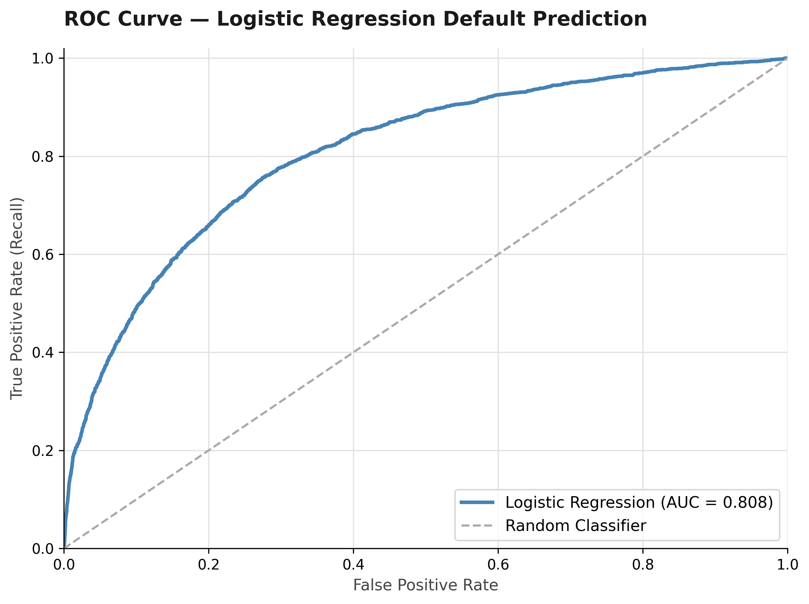
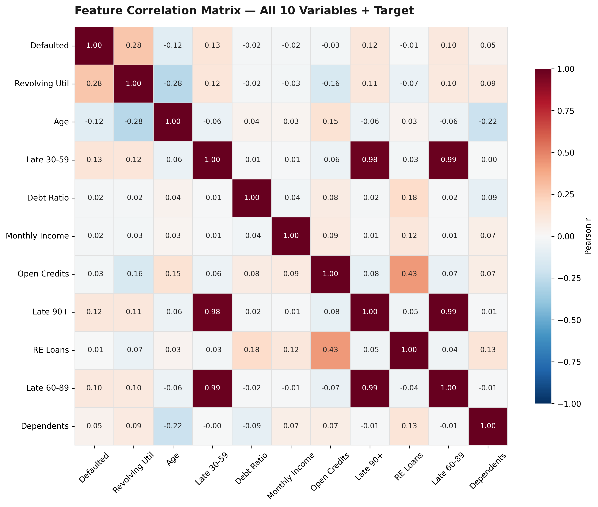
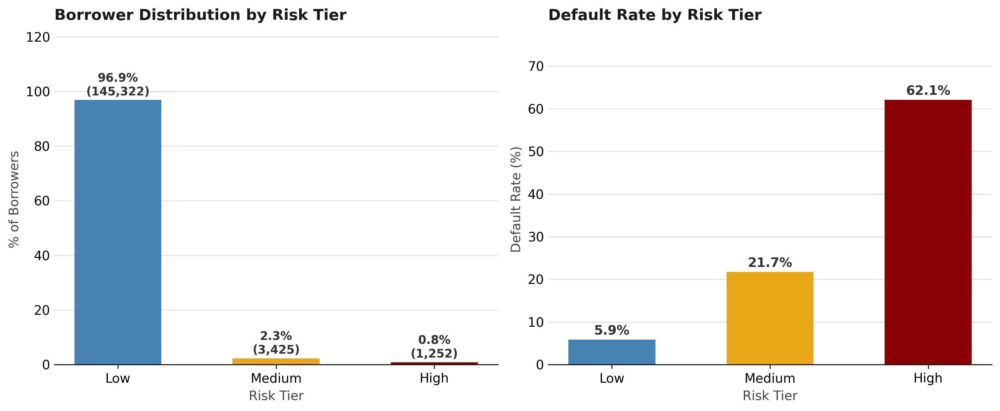

# Loan Default Risk Analysis

Credit risk analysis identifying the behavioral and demographic drivers of borrower default across 150,000 accounts. Using Kaggle's Give Me Some Credit dataset, the analysis pinpoints delinquency history and revolving utilization as the strongest predictors of default — with income alone proving too weak to use standalone.

---

## Key Findings

1. **90-Days-Late Dominant Predictor:** 60.45% default rate at 3+ late payments vs 4.63% for clean records — a 13x difference that makes payment history the clearest early warning signal available.
2. **Revolving Utilization Gap:** Defaulters median 84% utilization vs 13% for non-defaulters. Near-maximum balances signal financial stress and limited buffer against income shocks.
3. **Age Effect:** Under-30 group 11.73% default rate vs 3.10% for 60+ age group — a monotonic decline reflecting shorter credit histories and less financial stability.
4. **Income Weak Standalone:** Income alone is a poor predictor without behavioral signals. Defaulters skew lower-income but distributions overlap too heavily for reliable separation.
5. **Composite Risk Score Separates Borrowers Cleanly:** Combining 3+ late payments (3pts), utilization >75% (2pts), and age <30 (1pt) into a simple scorecard produces a 10.5x default rate gap — High tier (0.8% of borrowers) at 62.1%, Medium (2.3%) at 21.7%, Low (96.9%) at 5.9%. The additive effect of behavioral signals confirms that multi-signal scoring outperforms any single predictor.

---

## Model — Logistic Regression

Trained on the three strongest EDA predictors using an 80/20 train/test split with balanced class weights to handle the dataset's 6.7% default rate.

| Metric | Score |
|--------|-------|
| ROC-AUC | 0.808 |
| Recall (Default class) | 71.0% |
| Precision (Default class) | 17.5% |
| Accuracy | 75.7% |

**Feature importance (scaled coefficients):**
- `NumberOfTimes90DaysLate`: +1.278 — strongest predictor, confirms EDA finding
- `RevolvingUtilizationOfUnsecuredLines`: +0.865 — second strongest
- `age`: −0.236 — negative coefficient confirms younger = higher risk

**Interpretation:** ROC-AUC of 0.808 means the model correctly ranks a defaulter above a non-defaulter 80.8% of the time. High recall (71%) is intentional — in credit risk, missing a true defaulter (false negative) is more costly than a false alarm. Low precision reflects the class imbalance: defaults are rare, so even a well-calibrated model generates false positives.



---

## Dataset

| Field | Detail |
|-------|--------|
| Source | Kaggle — Give Me Some Credit competition |
| Rows | 150,000 borrowers |
| Columns | 11 (10 features + 1 target) |

---

## Tech Stack

- **Analysis:** Python (pandas, matplotlib, seaborn, numpy, plotly)
- **Modelling:** scikit-learn (LogisticRegression, StandardScaler, train_test_split)
- **Environment:** SQLite for structured querying
- **CI:** GitHub Actions (analysis reproducibility workflow)

---

## Project Structure

```
loan-default-analysis/
├── finding1_delinquency.py          # Chart: delinquency vs default rate
├── finding2_utilization.py          # Chart: revolving utilization boxplot
├── finding3_age.py                  # Chart: default rate by age group
├── finding4_income.py               # Chart: income KDE overlay
├── finding5_correlation_heatmap.py  # Chart: feature correlation matrix
├── finding6_risk_tier.py            # Chart: composite risk tier distribution + default rates
├── dashboard_plotly.py              # Interactive dashboard: 3-panel Plotly HTML
├── model_logistic_regression.py     # Logistic regression model + ROC curve
├── visuals/
│   ├── finding1_delinquency.png
│   ├── finding2_utilization.png
│   ├── finding3_age.png
│   ├── finding4_income.png
│   ├── correlation_heatmap.png
│   ├── risk_tier_distribution.png
│   ├── loan_risk_dashboard.html
│   └── roc_curve.png
├── cs-training.csv              # Raw dataset (excluded from git)
├── cs-training-cleaned.csv      # Cleaned dataset (excluded from git)
├── CLAUDE.md                    # Project context and session notes
└── README.md
```

---

## Visualizations







**Interactive Dashboard:** [loan_risk_dashboard.html](visuals/loan_risk_dashboard.html) — delinquency bar chart, utilization box plot, and age group line chart with hover tooltips.

---

## How to Run

1. Clone the repo: `git clone https://github.com/Ausmin787/loan-default-analysis.git`
2. Install dependencies: `pip install pandas matplotlib seaborn numpy plotly scikit-learn`
3. Run each analysis script:
   ```bash
   python finding1_delinquency.py
   python finding2_utilization.py
   python finding3_age.py
   python finding4_income.py
   python finding5_correlation_heatmap.py
   python finding6_risk_tier.py
   python dashboard_plotly.py
   python model_logistic_regression.py
   ```
4. Charts saved to `visuals/`

---

## Author

Data Analyst Portfolio Project | [github.com/Ausmin787/loan-default-analysis](https://github.com/Ausmin787/loan-default-analysis)

**Ausmin** — Data Analytics, Finance minor | DBS Global University  
LinkedIn: [ausmindeb](https://www.linkedin.com/in/ausmindeb) | Email: ausmindeb32@gmail.com  
Open to internship opportunities in data analytics, credit risk, and financial modeling.
