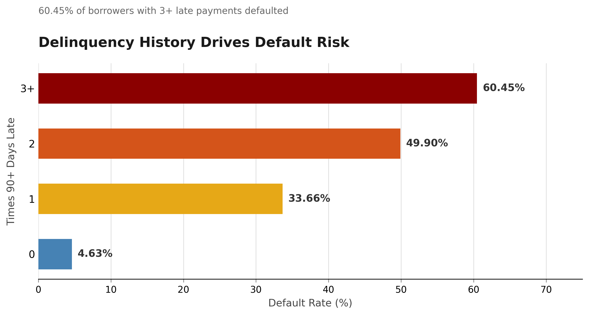
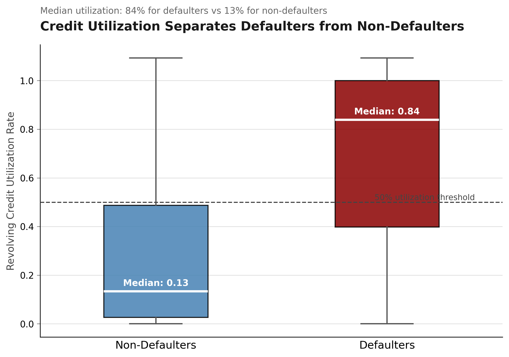
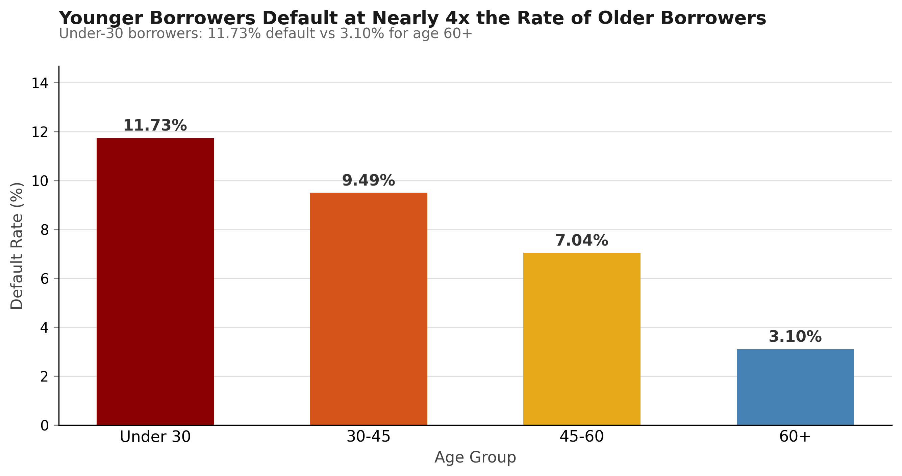
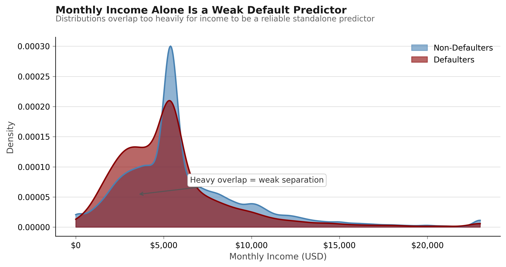

# Loan Default Risk Analysis
Credit risk analysis identifying the behavioral and demographic drivers of borrower default across 150,000 accounts.

---

## Business Conclusion

Banks should prioritize delinquency history in early warning systems because 60.45% of borrowers with 3+ late payments defaulted — repeated missed payments are the strongest signal of elevated default probability and should trigger immediate risk controls like credit limit reduction or enhanced monitoring. Credit utilization compounds the risk signal: defaulters carry a median utilization of 84%, indicating borrowers who are both behaviorally delinquent and financially stretched. Age adds a structural lens — under-30 borrowers default at nearly four times the rate of borrowers over 60, pointing to portfolio-level concentration risk in younger segments. Income, by contrast, offers limited standalone discriminatory power due to heavy distributional overlap and should be treated as a secondary variable, weighted only in combination with behavioral indicators.

---

## Key Findings

### 1. Delinquency History Is the Dominant Predictor

**60.45% default rate** among borrowers with 3+ payments 90+ days late — vs. 4.63% for clean borrowers.

A 13x difference in default rate between clean borrowers and the most delinquent group makes payment history the clearest early warning signal available. Any borrower crossing the 3+ threshold should be flagged for immediate review.



---

### 2. Credit Utilization Separates Defaulters from Non-Defaulters

**Median utilization 84% (defaulters) vs. 13% (non-defaulters).**

Defaulters are running near-maximum balances on revolving credit. High utilization signals both financial stress and limited available buffer — a borrower with 80%+ utilization has little room to absorb income shocks before missing payments.



---

### 3. Younger Borrowers Carry Disproportionate Default Risk

**11.73% default rate under age 30 vs. 3.10% for age 60+.**

The monotonic decline in default rate with age reflects both shorter credit histories and less financial stability in younger cohorts. Portfolios with high under-30 concentration should apply tighter underwriting thresholds or require compensating factors such as income documentation or co-signers.



---

### 4. Monthly Income Is a Weak Standalone Predictor

**Defaulters skew lower-income, but the distributions overlap too heavily for reliable separation.**

Income shows directional correlation but poor group separation — both defaulters and non-defaulters concentrate in the $3,000–$7,000 monthly range. Income becomes actionable only in combination with behavioral variables like utilization and delinquency history, not as a primary screening variable.



---

## Dataset

**Give Me Some Credit** — Kaggle (2011)

| Attribute | Detail |
|-----------|--------|
| Rows | 150,000 borrowers |
| Variables | 11 (10 features + 1 target) |
| Target | `SeriousDlqin2yrs` — 90+ day delinquency within 2 years |
| Default rate | 6.68% |
| Class imbalance | ~14:1 non-default to default ratio |

The class imbalance is material: a naive classifier predicting no default achieves 93.3% accuracy. Findings here focus on conditional default rates and distributional analysis rather than classification metrics.

---

## Methodology

**Exploration** — Assessed distributions, null rates, and outlier severity across all 11 variables. Identified `MonthlyIncome` (19.8% missing) and `NumberOfDependents` (2.6% missing) as requiring imputation. Flagged extreme outliers in `RevolvingUtilizationOfUnsecuredLines` and `NumberOfTimes90DaysLate`.

**Cleaning**
- Median imputation for `MonthlyIncome` and `NumberOfDependents` (robust to skew, preserves distributional shape)
- 99th percentile capping on utilization and late-payment variables (removes data entry errors without discarding records)
- Removed one record with `age = 0` (invalid, likely data entry error)

**Analysis** — Conditional default rates by delinquency bucket, age group; distributional comparison of utilization and income by default status; KDE overlay for income separation assessment.

---

## Tools Used

| Tool | Purpose |
|------|---------|
| Python 3 | Core language |
| pandas | Data manipulation, groupby aggregations |
| matplotlib | All charts and visualizations |
| NumPy | KDE computation, percentile capping |

---

## Project Structure

```
loan-default-analysis/
├── cs-training.csv                  # Raw dataset (149,999 rows)
├── cs-training-cleaned.csv          # Cleaned dataset, analysis-ready
├── finding1_delinquency.py          # Chart: delinquency vs default rate
├── finding2_utilization.py          # Chart: revolving utilization boxplot
├── finding3_age.py                  # Chart: default rate by age group
├── finding4_income.py               # Chart: income KDE overlay
├── visuals/
│   ├── finding1_delinquency.png
│   ├── finding2_utilization.png
│   ├── finding3_age.png
│   └── finding4_income.png
├── CLAUDE.md                        # Project log and session notes
└── README.md
```

---

## How to Run

```bash
# Clone the repo
git clone https://github.com/Ausmin787/loan-default-analysis.git
cd loan-default-analysis

# Install dependencies
pip install pandas matplotlib numpy

# Reproduce all charts
python finding1_delinquency.py
python finding2_utilization.py
python finding3_age.py
python finding4_income.py
```

Charts are saved to `visuals/` at 300 DPI.

---

## Author

**Ausmin** — Data Analytics, Finance minor | DBS Global University  
GitHub: [Ausmin787](https://github.com/Ausmin787)  
LinkedIn: [ausmindeb](https://www.linkedin.com/in/ausmindeb)  
Email: ausmindeb32@gmail.com  
Open to internship opportunities in credit risk, risk analytics, and financial modeling.
